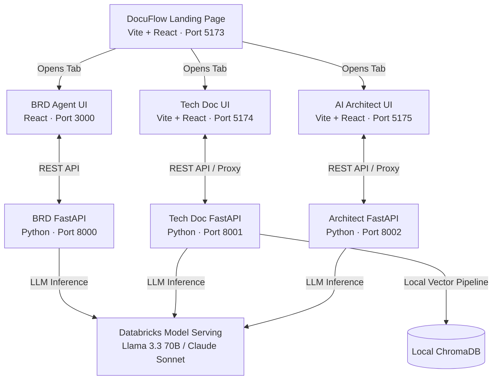
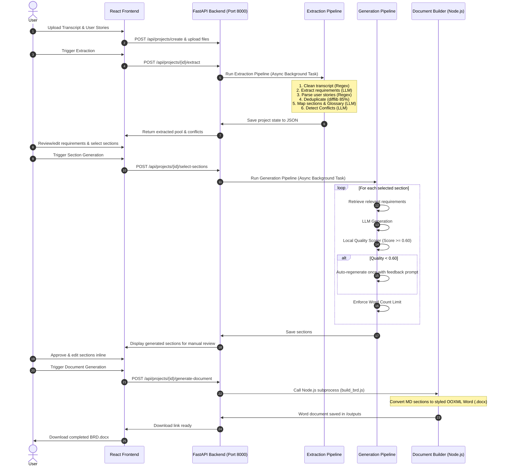
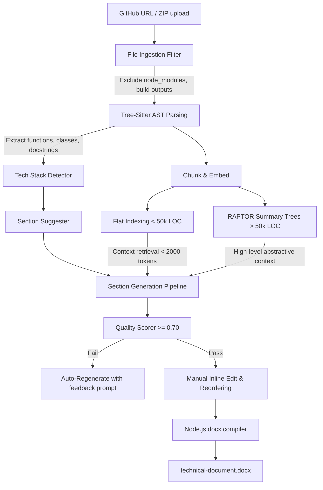
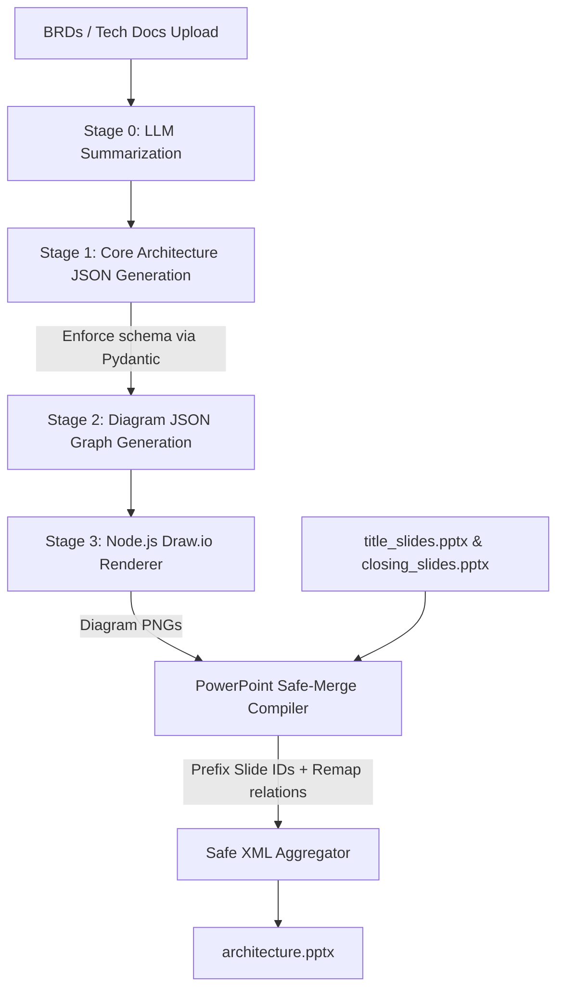
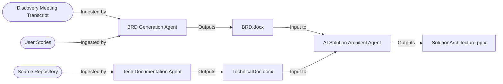

# DocuFlow Agentic Documentation & Architecture Suite

DocuFlow is an enterprise-grade, multi-agent suite designed to automate the generation of professional business, technical, and architectural documentation. By integrating semantic analysis, local AST parsing, hybrid retrieval systems (Flat Indexing & RAPTOR), and PowerPoint OOXML manipulation, DocuFlow turns raw inputs (transcripts, user stories, source repositories) into production-ready assets—entirely under local control and using secure LLM endpoints.

This repository orchestrates **three independent, AI-powered agents** aligned through a central landing hub. This README provides a comprehensive system architecture reference to give another AI agent a complete, actionable understanding of the entire codebase and its agentic pipelines.

---

## 🌐 Suite Overview & Service Topology

The suite consists of a central router landing page and three standalone frontend-backend pairs. Each agent is designed around a FastAPI Python backend and a React frontend, communicating asynchronously to handle long-running document generation jobs.



### Port Mapping & Entry Points

| Service Component | Role | Dev Command | Port | Key Code Directory |
| :--- | :--- | :--- | :---: | :--- |
| **Landing Page** | Static Vite hub routing to individual agents | `npm run dev` | `5173` | [main_landing_page](file:///c:/Programming%20and%20Coding/documentation-agent/main_landing_page) |
| **BRD Agent Frontend** | React UI for transcript parsing & review | `npm start` | `3000` | [brd-agent/frontend](file:///c:/Programming%20and%20Coding/documentation-agent/brd-agent/frontend) |
| **BRD Agent Backend** | FastAPI business requirements pipeline | `python main.py` | `8000` | [brd-agent/backend](file:///c:/Programming%20and%20Coding/documentation-agent/brd-agent/backend) |
| **Tech Doc Frontend** | Vite React UI for repo ingest & formatting | `npm run dev` | `5174` | [technical-document/frontend](file:///c:/Programming%20and%20Coding/documentation-agent/technical-document/frontend) |
| **Tech Doc Backend** | Code analyzer, ChromaDB & generation RAG | `python run.py` | `8001` | [technical-document/backend](file:///c:/Programming%20and%20Coding/documentation-agent/technical-document/backend) |
| **Solution Architect UI** | React UI for diagram configuration & slides | `npm run dev` | `5175` | [ai_solution_architect_v2/frontend](file:///c:/Programming%20and%20Coding/documentation-agent/ai_solution_architect_v2/frontend) |
| **Solution Architect Backend** | Architecture mapper & OOXML Slide compiler | `python run.py` | `8002` | [ai_solution_architect_v2/backend](file:///c:/Programming%20and%20Coding/documentation-agent/ai_solution_architect_v2/backend) |

---

## 📄 Deep-Dive: BRD Generation Agent (`brd-agent`)

The BRD Agent transforms unstructured meeting discovery transcripts and raw user stories into a formalized, standard **Business Requirements Document (BRD)**.



### Core Architecture & Key Modules

- **Project Entry & Routes**: Configured in [main.py](file:///c:/Programming%20and%20Coding/documentation-agent/brd-agent/backend/main.py). Manages background tasks, project status polling, conflict resolution endpoints, and version history.
- **Extraction Pipeline**: Defined in [extraction_pipeline.py](file:///c:/Programming%20and%20Coding/documentation-agent/brd-agent/backend/pipelines/extraction_pipeline.py).
  - *Transcript Cleaning*: Removes speaker tags, fillers, and stutters using regex rules to compress input tokens by 30-40%.
  - *Deduplication*: Implements a local difflib sequence matcher utilizing an 85% similarity threshold to merge duplicate requirements from different sources.
  - *Conflict Detector*: Call system prompts in [conflict_detector.py](file:///c:/Programming%20and%20Coding/documentation-agent/brd-agent/backend/agents/conflict_detector.py) to highlight competing descriptions, priorities, or logic.
- **Section Prompts & Suggester**: Located in [section_suggester.py](file:///c:/Programming%20and%20Coding/documentation-agent/brd-agent/backend/agents/section_suggester.py). Analyzes the requirement categories (functional vs. non-functional) and maps them to standard sections using predefined business rules. Prompt formats are loaded from [section_prompts.py](file:///c:/Programming%20and%20Coding/documentation-agent/brd-agent/backend/agents/section_prompts.py) to maintain specialized formats for the 19 standard BRD sections.
- **Traceability Matrix**: Defined in [traceability.py](file:///c:/Programming%20and%20Coding/documentation-agent/brd-agent/backend/features/traceability.py). Generates a mapping table linking final document sections back to the unique requirement IDs and original transcript snippets.
- **Living BRD Version Control**: Handled in [living_brd.py](file:///c:/Programming%20and%20Coding/documentation-agent/brd-agent/backend/features/living_brd.py). Detects delta changes when a follow-up transcript is uploaded, compares requirements across versions, generates a change log, and updates the version integer upon user approval.
- **Quality Assurance & Metrics**:
  - The generation pipeline in [generation_pipeline.py](file:///c:/Programming%20and%20Coding/documentation-agent/brd-agent/backend/pipelines/generation_pipeline.py) checks that generated sections are structured and exceed a minimum word threshold. Sections failing the heuristic check are flagged and automatically retried once.
  - Metrics are recorded on each run using the [collector.py](file:///c:/Programming%20and%20Coding/documentation-agent/brd-agent/backend/metrics/collector.py) script. It logs tokens, execution duration, conflicts resolved, and manual rework rates.

---

## 🔧 Deep-Dive: Technical Documentation Agent (`technical-document`)

This agent analyzes code repositories (GitHub clones or ZIP uploads) to compile detailed technical architecture documents, API mappings, and installation sheets.



### Core Architecture & Key Modules

- **Project Entry**: Structured in [main.py](file:///c:/Programming%20and%20Coding/documentation-agent/technical-document/backend/main.py) which exposes the route namespaces `/ingest`, `/sections`, `/context`, `/generate`, and `/api` (for assembly).
- **Codebase Parser**:
  - *Tree-Sitter Analyzer*: Found in [tree_sitter_analyzer.py](file:///c:/Programming%20and%20Coding/documentation-agent/technical-document/backend/core/analysis/tree_sitter_analyzer.py). Uses AST structures to extract class signatures, inheritances, function parameters, and docstrings.
  - *Tech Stack Detector*: Found in [tech_stack_detector.py](file:///c:/Programming%20and%20Coding/documentation-agent/technical-document/backend/core/analysis/tech_stack_detector.py). Inspects package configuration manifests (e.g. `package.json`, `requirements.txt`, `go.mod`) and uses regex keyword matching on source files to identify frameworks, databases, and continuous integration paths.
- **RAG & Vector Context Pipeline**:
  - *Chunker*: Located in [chunker.py](file:///c:/Programming%20and%20Coding/documentation-agent/technical-document/backend/core/context_builder/chunker.py). Splits code files into 500-token snippets with a 50-token overlap to maintain context.
  - *Embedder*: [embedder.py](file:///c:/Programming%20and%20Coding/documentation-agent/technical-document/backend/core/context_builder/embedder.py) processes embeddings locally using a sentence-transformer model (`all-MiniLM-L6-v2`) running on local CPU, stored in [vector_store.py](file:///c:/Programming%20and%20Coding/documentation-agent/technical-document/backend/core/context_builder/vector_store.py).
  - *RAPTOR Summary Tree Builder*: Defined in [raptor_builder.py](file:///c:/Programming%20and%20Coding/documentation-agent/technical-document/backend/core/context_builder/raptor_builder.py). On larger codebases (>50k LOC), RAPTOR recursively clusters and summarizes vector embeddings to allow the LLM to access high-level structural overviews alongside fine-grained code files.
- **Generation & Quality Control**:
  - *Section Generator*: Defined in [section_generator.py](file:///c:/Programming%20and%20Coding/documentation-agent/technical-document/backend/core/generation/section_generator.py). Pulls the top-K snippets from the local vector database, formats the system prompts, and queries the LLM.
  - *Quality Scorer*: Defined in [quality_scorer.py](file:///c:/Programming%20and%20Coding/documentation-agent/technical-document/backend/core/generation/quality_scorer.py). Scores drafts on a 0-1 scale. Drafts with quality scores under 0.70 are regenerated using modified prompt parameters.
- **Document Assembler**:
  - The [document_builder.py](file:///c:/Programming%20and%20Coding/documentation-agent/technical-document/backend/core/assembler/document_builder.py) module serializes markdown into structured JSON and invokes a Node.js builder using a child process to compile the final `.docx` or `.pdf` layout.

---

## 🏗️ Deep-Dive: AI Solution Architect Agent (`ai_solution_architect_v2`)

The AI Solution Architect Agent inputs BRDs and technical documentations, generating a complete software architecture definition, visual diagrams (using Draw.io styles), and a structured PowerPoint presentation.



### Core Architecture & Key Modules

- **Project Entry & Router**: Entry point is [main.py](file:///c:/Programming%20and%20Coding/documentation-agent/ai_solution_architect_v2/backend/main.py). The generator route is located in [generate.py](file:///c:/Programming%20and%20Coding/documentation-agent/ai_solution_architect_v2/backend/routers/generate.py), managing text inputs, file extractions, and pptx download streams.
- **Architect Orchestrator**: The orchestration flow is defined in [orchestrator.py](file:///c:/Programming%20and%20Coding/documentation-agent/ai_solution_architect_v2/backend/services/orchestrator.py). It implements a 3-step LLM chain:
  - *Stage 0 (Summarize)*: Cleans and compresses incoming technical files to stay under the context limit.
  - *Stage 1 (Core Design)*: Generates a solution design schema (components, dependencies, technology alignments, and roads). The output format is structured and validated against Pydantic definitions in [response_models.py](file:///c:/Programming%20and%20Coding/documentation-agent/ai_solution_architect_v2/backend/models/response_models.py).
  - *Stage 2 (Diagram Mapping)*: Extracts component layouts and node connections, feeding them into a Javascript mapping module.
- **PowerPoint & OOXML Compiler**: Structured in [pptx_service.py](file:///c:/Programming%20and%20Coding/documentation-agent/ai_solution_architect_v2/backend/services/pptx_service.py).
  - *Safe Merge Algorithm*: Merging slide decks in OOXML formats often corrupts layouts. To resolve this, `_safe_merge_pptx()` only extracts slide XML pages (`ppt/slides/`) and their associated assets (`ppt/media/`), ignoring base templates and layout themes.
  - *Prefixing Slide IDs*: All slide targets are prefixed (e.g. `slide1.xml` becomes `m1_slide1.xml`) and relationships are re-mapped dynamically to prevent naming collisions.
  - *Content Types Registration*: Registered files are appended to the main `[Content_Types].xml` listing to avoid application errors when opening generated PPTX documents.
- **Draw.io Node.js Diagram Renderer**: Utilizes `generate_pptx.js` internally to construct valid Draw.io XML representations, rendering them to PNG layouts that are embedded directly within presentation slides.

---

## 🔗 Cross-Agent Data Flow & Integration

The agent suite is designed to be used in a sequential chain. This allows the output from one agent to be passed into another as context.



1. **Step 1: Requirements Gathering**: Run the **BRD Agent** on meeting transcripts and user stories. Download the generated `BRD.docx`.
2. **Step 2: Technical Grounding**: Upload your current codebase to the **Technical Documentation Agent** to compile a codebase blueprint. Download the generated `TechnicalDoc.docx`.
3. **Step 3: Solution Architecture Design**: Upload both the `BRD.docx` text and `TechnicalDoc.docx` to the **AI Solution Architect**. Run the pipeline to generate a comprehensive solution diagram, technology roadmaps, and a client-facing PPTX slide deck.

---

## 🛠️ Unified Development & Setup Guide

### System Prerequisites

- **Python**: `3.10` or higher
- **Node.js**: `18` or higher
- **Databricks Endpoint**: Active serving endpoint configured with Llama 3.3 70B Instruct or Claude Sonnet access tokens.

### Configuration & Environment Setup

Each agent backend requires a `.env` file containing local server configurations and Databricks endpoints. Copy `.env.example` in each backend directory to `.env` and fill in the missing fields:

```env
DATABRICKS_HOST=https://adb-<workspace-id>.azuredatabricks.net
DATABRICKS_TOKEN=dapi_your_personal_access_token_here
DATABRICKS_MODEL_ENDPOINT=your-serving-endpoint-name
APP_PORT=8000  # 8000 for BRD, 8001 for Tech Doc, 8002 for Architect
APP_ENV=development
```

### Running the Services

To run the entire suite locally, open seven terminals and execute the following start scripts:

#### 1. Main Landing Router
```bash
cd main_landing_page
npm install
npm run dev
# Running on http://localhost:5173
```

#### 2. BRD Agent
```bash
# Terminal 2 - Backend
cd brd-agent/backend
python -m venv venv
venv\Scripts\activate  # Unix: source venv/bin/activate
pip install -r requirements.txt
python main.py
# Running on http://localhost:8000

# Terminal 3 - Frontend
cd brd-agent/frontend
npm install
npm start
# Running on http://localhost:3000
```

#### 3. Technical Documentation Agent
```bash
# Terminal 4 - Backend
cd technical-document/backend
python -m venv venv
venv\Scripts\activate  # Unix: source venv/bin/activate
pip install -r requirements.txt
python run.py
# Running on http://localhost:8001

# Terminal 5 - Frontend
cd technical-document/frontend
npm install
npm run dev
# Running on http://localhost:5174
```

#### 4. Solution Architect Agent
```bash
# Terminal 6 - Backend
cd ai_solution_architect_v2/backend
python -m venv venv
venv\Scripts\activate  # Unix: source venv/bin/activate
pip install -r requirements.txt
python run.py
# Running on http://localhost:8002

# Terminal 7 - Frontend
cd ai_solution_architect_v2/frontend
npm install
npm run dev
# Running on http://localhost:5175
```

---

## 🐞 System Diagnostics & Troubleshooting

<details>
<summary><strong>PowerPoint File Corrupted / Office Repair Prompt</strong></summary>
If PowerPoint prompts you to repair files when opening generated PPTX documents, check the <code>_safe_merge_pptx()</code> function inside [pptx_service.py](file:///c:/Programming%20and%20Coding/documentation-agent/ai_solution_architect_v2/backend/services/pptx_service.py). Verify that Slide IDs and filenames have unique prefixes and that the default content mappings within <code>[Content_Types].xml</code> are sorted correctly per OOXML specifications.
</details>

<details>
<summary><strong>ChromaDB / Embedding Latency on Large Codebases</strong></summary>
The Technical Document Agent builds a local vector index upon the first run of a project. For large repositories (>50k LOC), this process can take several minutes. Ensure that files like <code>node_modules</code>, <code>dist</code>, and virtual environments (<code>.venv</code>) are added to the exclusion filters inside [file_filter.py](file:///c:/Programming%20and%20Coding/documentation-agent/technical-document/backend/core/ingestion/file_filter.py) to prevent indexing overhead.
</details>

<details>
<summary><strong>Databricks REST Client Timeouts</strong></summary>
The backends execute sequential LLM requests to build structural documents (such as requirements or roadmap sections). If you encounter API timeouts during generation, check that the <code>proxyTimeout</code> setting inside the frontend configurations (e.g. [vite.config.js](file:///c:/Programming%20and%20Coding/documentation-agent/ai_solution_architect_v2/frontend/vite.config.js)) is set to at least 420000ms (7 minutes) to prevent connections from dropping during background calculations.
</details>

<details>
<summary><strong>Word Document Formatting Issues</strong></summary>
The Word document assembler requires the underlying Node.js build tools. Ensure Node.js is active on the host machine. If markdown styling throws layout formatting errors, verify the formatting templates inside the docx builders (e.g., <code>doc_builder/build_brd.js</code>) and inspect child process exit codes.
</details>

---

## 📜 Development License

This suite is distributed under the **MIT License**. See the `LICENSE` file in the repository root for more details.
